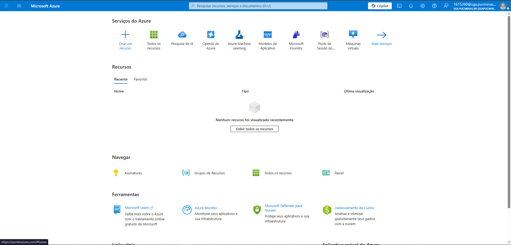
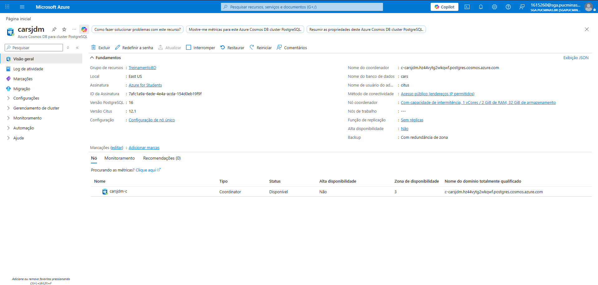
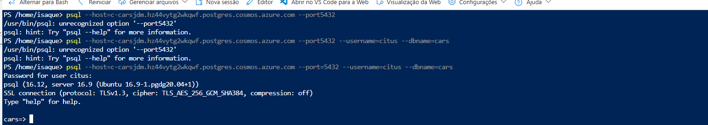
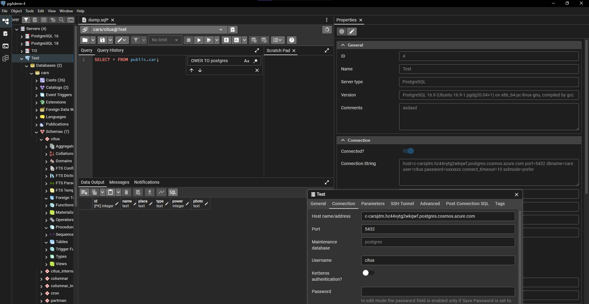
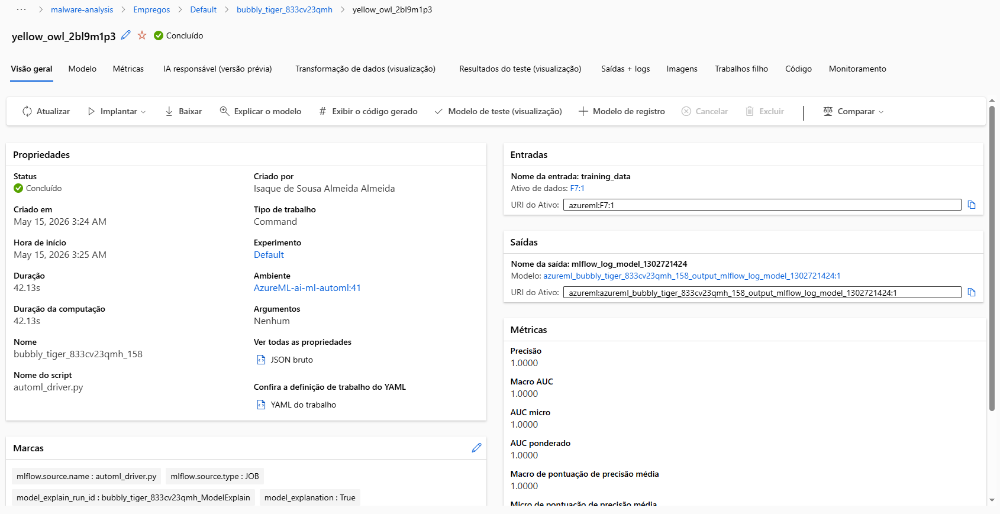
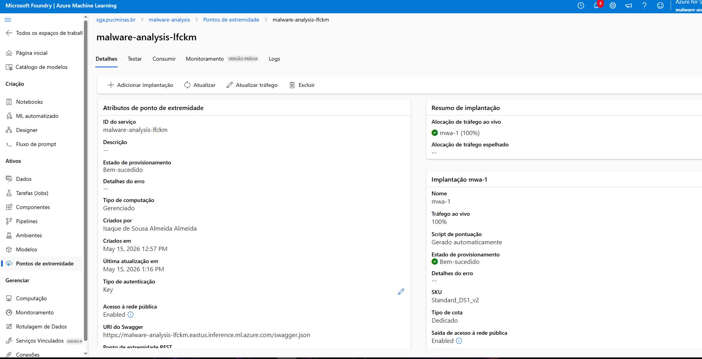
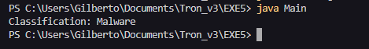

# Exercicio 4
### 01) Será necessário salvar no Git uma imagem com tela do Portal AzureLinks to an external site. que tenha indicação do seu usuário vinculado.

### 02) uma imagem informações sobre o "recurso" criado no Azure, que indique o nome do servidor (URL) e seu a conta no Azure.

### 03) uma imagem que mostre sua conexão ativa com o banco de dados e o resultado de uma query SQL de seleção (select).

### 04) No caso de escolher a opção (a), que se refere a criar um modelo de machine learning, envie uma imagem do fluxograma do seu modelo no Azure (Ex. Machine Learn Studio). No caso de optar em utilizar um serviço cognitivo, envie uma imagem do recurso criado no portal Azure com o seus detalhes.

## Resultado da ML

